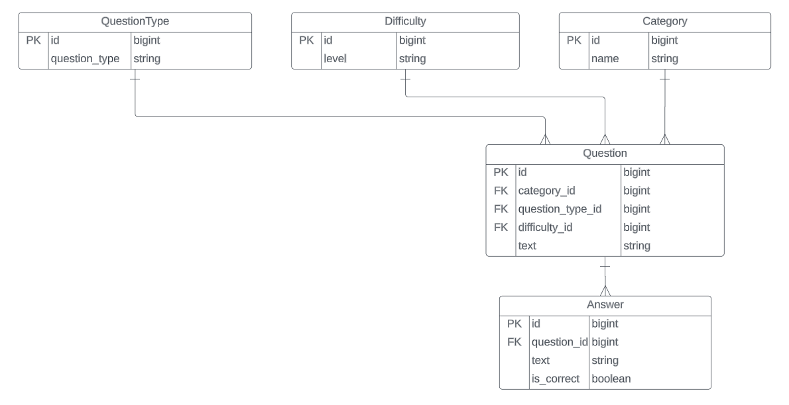

# Trivia Question Game Documentation

## Stack

- **backend**: Django
- **Database**: PostgreSQL

## Setup

To set up and run the project in a new development environment, follow these steps:

1. **Run a PostgreSQL server and create a database called** <br> ```trivia```
2. **Clone the git repository**
3. **Navigate to the project directory** <br> ```cd trivia_project```
4. **Install the dependencies:**<br>```poetry install``` (If poetry not installed run ```pip install poetry```) <br>
   The ```requirements.txt``` is also included.
5. **Create database migrations**
    1. ```python3 manage.py makemigrations trivia_app```
    2. ```python3 manage.py migrate```
6. **Run the application**: <br> ```python3 manage.py runserver```
7. **The application starts at** <br>`http://localhost:8000`

# Database Schema

**The database ERD**: <br>


The database schema is defined in models.py file in the trivia_app directory.

## Views/ Forms/ Templates

1. **In the `views.py` file, a single view is defined, presenting all the Questions along with their respective
   Categories, Difficulty-levels, and Answers. This view is associated with the home URL, which is set as `/` in
   the `urls.py` file**
2. Within the `forms.py` file, a Django Form is configured. This Form functions to display all available Categories and
   Difficulties. Additionally, it includes an input text field for the 'question_term'. This enables users to select
   filtering Query Parameters for the Question QuerySet.
3. **There are three Query Parameters**
    1. category: filter the Question QuerySet based on the category provided in the form
       field ```?category={category}```
    2. difficulty: filter the Question QuerySet based on the difficulty provided in the form
       field. ```?difficulty={difficulty}```
    3. question_term: filter the Question QuerySet based on the term typed in the form input
       field. ```?question_term={question_term}```
    4. You can combine all the Query parameters using ```&``` notation, in a logical AND way.

## Testing

1. **For testing purposes, the project employs Pytest, Factory boy.**
2. **You can find the tests in `trivia_app/tests/`**
3. **There is a comment for each test, specifying what is being tested.**
4. **To run the tests, execute the following command:** <br> ```pytest -rP```

## Data ingestion

1. **There is a python script `trivia_api_consume.py` which facilitates data insertion operations from the Trivia Api in
   order to populate questions in the database.**
2. **You can run the script:** <br>```python3 trivia_api_consume.py```
3. **The API endpoint used is `https://opentdb.com/api.php?amount=50` which responds with 50 random Questions.**
